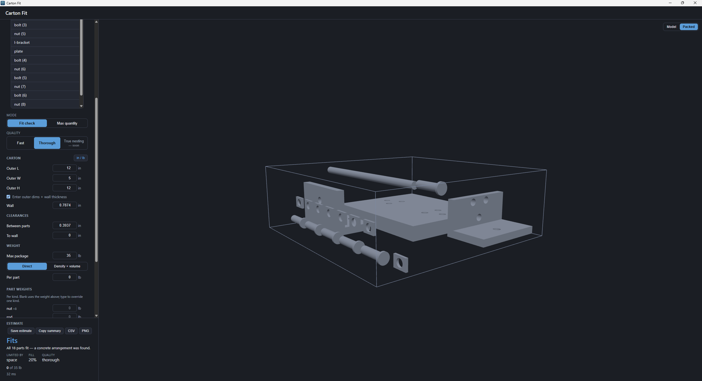

<p align="center">
  
</p>

<h1 align="center">Carton Fit</h1>

<p align="center">
  Drag in a CAD model, enter a carton, get the best packing orientation,
  part count, and a 3D view of the packed box.
</p>

<p align="center">
  <a href="https://github.com/LoganBresnahan/Carton-Fit/releases/latest"><strong>Version 1.0.0</strong></a>
  &nbsp;·&nbsp;
  <a href="https://github.com/LoganBresnahan/Carton-Fit/releases/latest">Download</a>
  &nbsp;·&nbsp;
  <a href="CHANGELOG.md">Changelog</a>
</p>

---

Given a 3D model of a part (or an assembly) and a shipping carton, Carton Fit
answers the questions packaging engineers actually ask — **does it fit, in what
orientation, and how many can I ship per box** — without doing the math by hand
or mocking it up physically.

Drop a STEP or STL file onto the window, type in the carton, and the estimate
follows your inputs live: no compute button. The 3D view shows either the model
or the packed carton with every part in its computed position.

<p align="center">
  
</p>

## Features

- **STEP and STL import**, including multi-part assemblies, parsed off the UI
  thread by [OpenCascade](https://github.com/kovacsv/occt-import-js) compiled to
  WebAssembly.
- **Two questions, two modes.** *Fit check*: do all the parts in this file fit
  in this box? *Max quantity*: how many copies of a part (or of the whole file
  as one unit) fit?
- **Two quality tiers.** *Fast* answers instantly from axis-aligned bounding
  boxes over six orientations; *Thorough* computes a minimal oriented bounding
  box and searches rotations. True shape nesting is designed for but not yet
  implemented.
- **Weight is a hard constraint, not a footnote.** Set a max package weight
  (default 35 lb); enter part weight directly or derive it from material
  density × mesh volume. Either is a *default*: in a mixed assembly you can
  override the weight of any **kind** of part individually — one entry covers
  all six instances of a bolt. Every result states which constraint — space or
  weight — was the binding one.
- **Honest numbers.** Counts are labeled as heuristic where they are heuristic,
  a positive fit is backed by a concrete arrangement, and a density weight
  resting on an open (non-watertight) mesh is flagged rather than reported as
  fact — a wrong weight would become a confidently wrong part count.
- **Clearances** for dunnage and foam: part-to-part and part-to-wall, plus
  inner dimensions directly or outer dimensions with wall thickness.
- **mm ⇄ inch** display toggle (kg ⇄ lb correspondingly); everything is stored
  in millimeters and grams internally.
- **Presets and saved estimates.** Carton setups save under a name and reload.
  Estimates you *choose* to keep are saved to a local SQLite database, keyed by
  a content hash so they survive a file rename — and restoring one loads its
  inputs and recomputes, so the answer on screen is never a replay.
- **Undo/redo over the inputs** (Ctrl+Z / Ctrl+Shift+Z). Typing a dimension is
  one step, not one per keystroke.
- **Export what you found.** Copy the estimate as text for a quote or an email,
  save the per-part measurements as a CSV, or save the packed view as a PNG.
  Warnings travel with every export: an answer that is qualified on screen
  stays qualified once it leaves the app.

## Install

Grab the latest installer from
[Releases](https://github.com/LoganBresnahan/Carton-Fit/releases):

- **Windows** — `Carton-Fit-Setup-1.0.0.exe` (NSIS installer). The build is
  currently unsigned, so SmartScreen will warn on first run; choose "More info"
  → "Run anyway".
- **Linux** — `Carton-Fit-1.0.0-linux.AppImage`; make it executable and run it.
- **macOS** — not yet built. The configuration exists, but a dmg nobody can
  test is an untested artifact wearing a ship label; it waits for a Mac to
  verify it on.

What changed between versions is in [CHANGELOG.md](CHANGELOG.md).

## Development

Prerequisites: Node 24+, and a C++ toolchain (`gcc`/`g++`/`make`/`python3` on
Linux, MSVC on Windows) — `better-sqlite3` is compiled from source against
Electron's ABI at package time.

```sh
npm ci
npm run dev            # Vite HMR + Electron window
npm test               # vitest unit suite (core math, DB, stores)
npm run typecheck      # tsc over src, tests, e2e, samples
npm run package        # build + linux-unpacked (the e2e smoke target)
npm run e2e            # Playwright-Electron specs against the dev build
npm run e2e:packaged   # the same specs against the packaged binary — the deploy gate
```

One sharp edge: after `npm run package`, the native module holds Electron's ABI,
so `npm test` triggers an automatic ~0.5 s rebuild back to Node's. From a VSCode
terminal, unset `ELECTRON_RUN_AS_NODE` before `npm run dev` (VSCode exports it,
and it makes Electron behave as plain Node).

The architecture, every substantive decision, and the reasoning behind them live
in [`doc/`](doc/) — [`VISION.md`](doc/VISION.md) for product intent,
[`doc/adr/`](doc/adr/) for the decision records, [`doc/roadmap.md`](doc/roadmap.md)
for build order.

## How the answer is produced

Packing runs in a web worker as pure TypeScript — no DOM, no three.js — so the
same functions the app ships are unit-tested directly against hand-computed
golden fixtures in [`samples/`](samples/). Those fixtures are shared by three
verification layers (vitest, Playwright-Electron e2e, and dogfooding on real
parts), so the layers cannot silently disagree. Results are presented with
their epistemic direction intact: a placement the engine found is stated as
fact; a count it could not beat is stated as a bound, not a proof.

## License

[MIT](LICENSE). Bundled third-party components and their licenses are listed in
[THIRD-PARTY-NOTICES.md](THIRD-PARTY-NOTICES.md) — notably `occt-import-js`
(LGPL-2.1), whose WebAssembly binary ships as a separate replaceable file
precisely so the LGPL's relink right is real; the release pipeline verifies
that substituting it actually takes effect.
